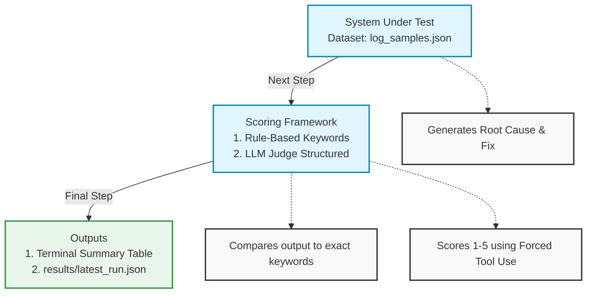

# SRE Log Analyst - LLM Evaluation Framework

This project evaluates the performance of an LLM-based SRE (Site Reliability Engineering) log analyst assistant. It uses a combination of **rule-based evaluation** and an **LLM-as-a-Judge** framework to score the assistant's ability to diagnose root causes and suggest appropriate technical fixes.

---

## 🛠️ Architecture Overview

The framework processes a dataset of mock server logs and passes them through three distinct stages:


---

## 📁 Directory Structure

*   `eval_runner.py`: The main entry point script that orchestrates the execution loop, computes summary statistics, and saves output.
*   `datasets/log_samples.json`: Contains 10 synthetic test cases spanning `easy`, `medium`, and `hard` difficulties with predetermined logs, expected root causes, and keyword filters.
*   `scorers/rule_based.py`: Computes absolute verification metrics by checking for required keyword combinations in the assistant's response.
*   `scorers/llm_judge.py`: Leverages a premium model (`claude-3-5-sonnet-20241022`) to qualitatively score responses based on accuracy, completeness, actionability, and clarity.
*   `results/latest_run.json`: Auto-generated output directory and payload containing the detailed metrics for every test execution.

---

## ⚙️ Engineering Edge Cases Resolved

During implementation, three major engineering friction points were solved:
1.  **Script Interpreter Context Execution**: Added the `#!/usr/bin/env python3` shebang to `eval_runner.py` to allow direct execution (`./eval_runner.py`) from the bash shell using the active virtual environment (`.venv`) interpreters.
2.  **JSON Validation via Forced Tool Use**: To prevent the LLM Judge from returning conversational prose or markdown formatting (which breaks `json.loads()`), the prompt utilizes Anthropic **Forced Tool Use** via `tool_choice={"type": "tool", "name": "submit_evaluation"}`. This forces the model to respond strictly via a predictable object schema.
3.  **Dynamic I/O Folder Creation**: Handled runtime OS level errors by inserting `os.makedirs("results", exist_ok=True)` ahead of write operations, eliminating file-writing failures if directories are cleared. -- Went with manual results folder creation for now.

---

## 🚀 How to Run the Evaluation

### 1. Set Up Environment Variables
Ensure your virtual environment is active and your API token is exported into your configuration path or `.env` file:
```bash
source .venv/bin/activate
export ANTHROPIC_API_KEY="your-api-key-here"
```

### 2. Execute Runner
Execute the script natively:
```bash
./eval_runner.py
```

### 3. Check Results
The execution engine outputs a summary to the standard terminal layout and serializes granular breakdowns into your historical data file:
```bash
cat results/latest_run.json
```